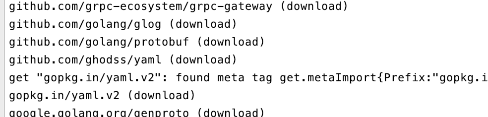

## 1. `Grpc+Grpc+Gateway` 安装与使用

```shell
└── src
    └── gateway
        ├── client
        │   └── main.go
        ├── service
        │   └── main.go
        │── images
        │		└── wx.png
        │── pkg
        │		└── ui
        │				 └── data
        │				 			└── swagger
        │── third_party
        └── pb
        		│── google
        		│			└── api
            ├── user.pb.go
            ├── user.pb.gw.go
            └── user.proto
```

#### 1.1  安装`grpc-gateway` 

```shell
$ go get -u -v github.com/grpc-ecosystem/grpc-gateway/protoc-gen-grpc-gateway
$ go get -u -v github.com/grpc-ecosystem/grpc-gateway/protoc-gen-swagger
$ go get -u -v github.com/golang/protobuf/protoc-gen-go
```

安装时间可能略长:



#### 1.2 安装成功后

```shell
$ cd pb 
$ sudo vi user.proto
```

写入文件：

```protobuf
//版本号
syntax = "proto3";
//包名
package go.grpc.gateway.user;
//引入包
import "google/api/annotations.proto";
//服务
service GetUserInfo{
    rpc GrpcGetUserInfo(Request) returns (Response){
        option (google.api.http) = {
			post: "/user"
            body: "*"
			};
    }
}
// 请求参数
message Request{
    string uid = 1;
}
// 返回参数
message Response{
    string name = 2;
}
```

将http.proto与annotations.proto拖进文件夹google/api:

```shell
$ cd gateway
$ protoc -I . --go_out=plugins=grpc,Mgoogle/protobuf/descriptor.proto=github.com/golang/protobuf/protoc-gen-go/descriptor:. google/api/*.proto
```

生成文件:


#### 1.2 `pb`文件生成

```shell
$ cd pb 
# 生成pb.go 文件
protoc -I/usr/local/include -I. \
  -I$GOPATH/src \
  -I$GOPATH/src/github.com/grpc-ecosystem/grpc-gateway/third_party/googleapis \
  --go_out=plugins=grpc:. \
  *.proto

# 生成pb.gw.go文件
protoc -I/usr/local/include -I. \
  -I$GOPATH/src \
  -I$GOPATH/src/github.com/grpc-ecosystem/grpc-gateway/third_party/googleapis \
  --grpc-gateway_out=logtostderr=true:. \
  *.proto
```

生成效果:


#### 1.3 生成`Swagger`文件

```shell
$ cd pb 
# 生成swager.json
protoc -I/usr/local/include -I. \                                                                                            
-I$GOPATH/src  -I$GOPATH/src/github.com/grpc-ecosystem/grpc-gateway/third_party/googleapis \
--swagger_out=logtostderr=true:. \
*.proto
```

生成效果：


将Swagger UI转为Go源码:

```shell
#下载地址：https://github.com/swagger-api/swagger-ui
# 将 third_party拷贝到项目中
$ go get -u github.com/jteeuwen/go-bindata/...
# 安装完成后
$ cd gateway
# 执行
go-bindata --nocompress -pkg swagger -o pkg/ui/data/swagger/datafile.go third_party/swagger-ui/...
# 生成pkg文件
```


#### 1.4 `Swagger UI`文件服务器

```shell
$ go get github.com/elazarl/go-bindata-assetfs/...
```

